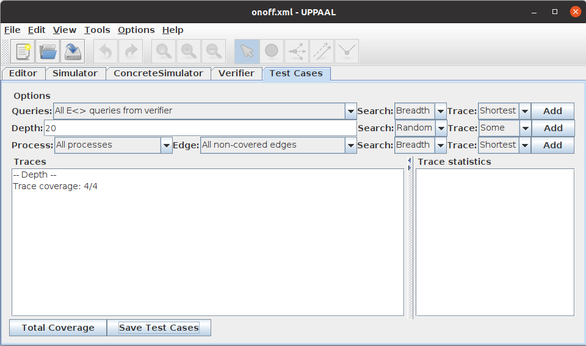

Yggdrasil (Test Cases tab) is an offline test-case generation tool with a purpose of increasing edge coverage. It [generates traces](traces/) from the model, and translates them into test cases based on [test code](test-code/) entered into the model on edges and locations next to comments.

The main features of the Test Cases generator are:
- The generated test code is backend agnostic, meaning that it is user-defined and independent of specific test execution engines.  
- Three modes for test case generation: 
  - Test purpose mode:  Generates a test case specified by a reachability query
  - An auto-depth mode: Generates tests automatically aiming at achieving edge/location coverage 
  - Single-step mode: Generates an individual test case per uncoverd edge. 
- Visualization of coverage

### Determinism 
Yggdrasil expects a _deadlock free_ and mostly _deterministic_ model.

Deadlocks can be checked against in the [Verifier](/gui-reference/verifier/) tab using <tt>A[] not deadlock</tt> query.

There are no checks or reinforcements made for determinism. Non-deterministic implementation requirements (behavior not controlled by a test execution harness) may yield test-cases which cannot be executed in a controlled manner. For example, test execution harness might not be able to force the implementation under test to respond in a specific way assumed by a test case if the implementation is allowed to respond in multiple ways non-deterministically. The environment assumption model (edges controlled by the test execution harness) is encouraged to be non-deterministic to facilitate a more focused and flexible control when selecting test cases.

### Basic operation
The buttons _*Add*_ will generate traces based on the verification options selected in the [Options menu](/gui-reference/menu-bar/options/) where the search order and diagnostic trace options are _**overridden**_ by the corresponding drop-down list selection. Unless intimately familiar with the search algorithms of Uppaal, leave the options at their default settings. 

The traces are added and shown in the _*Traces*_ list below on the left. Selecting a trace will show the statistics for this trace in the _*Trace statistics*_ on the right. The _*Total Coverage*_ button will show the combined statistics of all the traces added so far. Double clicking a trace loads the trace in the Simulator tab, where the execution scenario can be examined in detail. [Simulator](/gui-reference/symbolic-simulator/process/) colors the covered locations and edges in blue when _*Mark Visited*_ option is selected under the [View menu](/gui-reference/menu-bar/view/).

Test cases are exported to a specified directory specified by clicking _*Save Test Cases*_ button at the bottom. Previously stored test cases are overwritten by new test ones.

_**Note:** the traces and statistics are lost when the model is reloaded. Traces and statistics are not saved with the model. Only the test cases can be saved._

### Suggested methodology: 
Test Cases can be generated in several ways, depending on the actual project, but it is designed to support the method outlined below: 
1. Test purposes very often represent mandatory critical observations that must be observed on the system under test. First, _*Add*_ the test cases representing the test purposes. These test are mandated anyway, and will cover some parts of the model, but this coverage is typically insufficient.  
2. Generate tests that improves the (edge/location) coverage of the model (but does not guarantee so). Second, _*Add*_ the test cases using the auto-depth mode to improve the coverage.   
3. The coverage achieved by the second step can be completed by adding an individual test-case for each of these uncovered edges or locations. Hence, third, _*Add*_ the test cases using the single-step mode.
