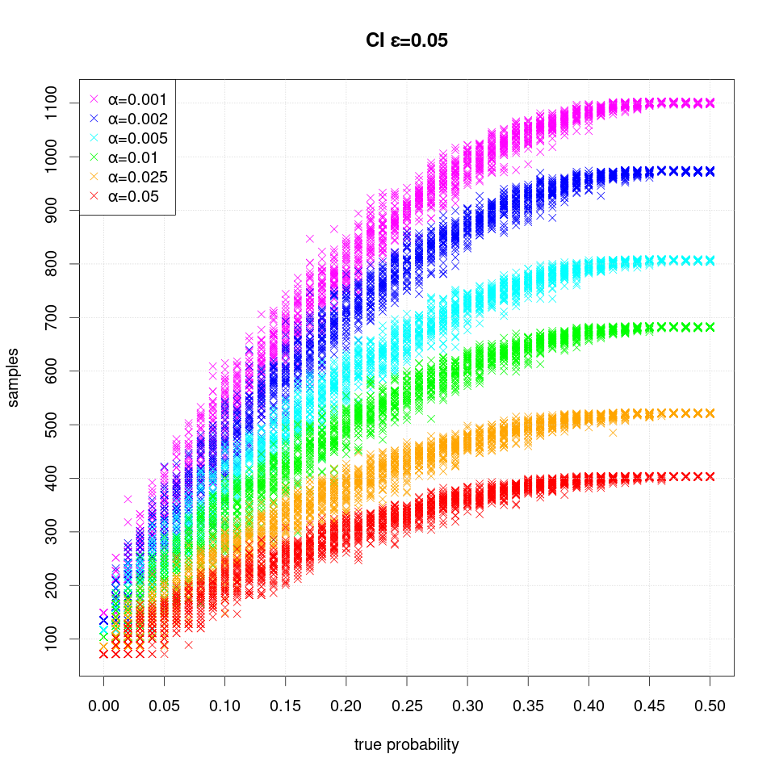
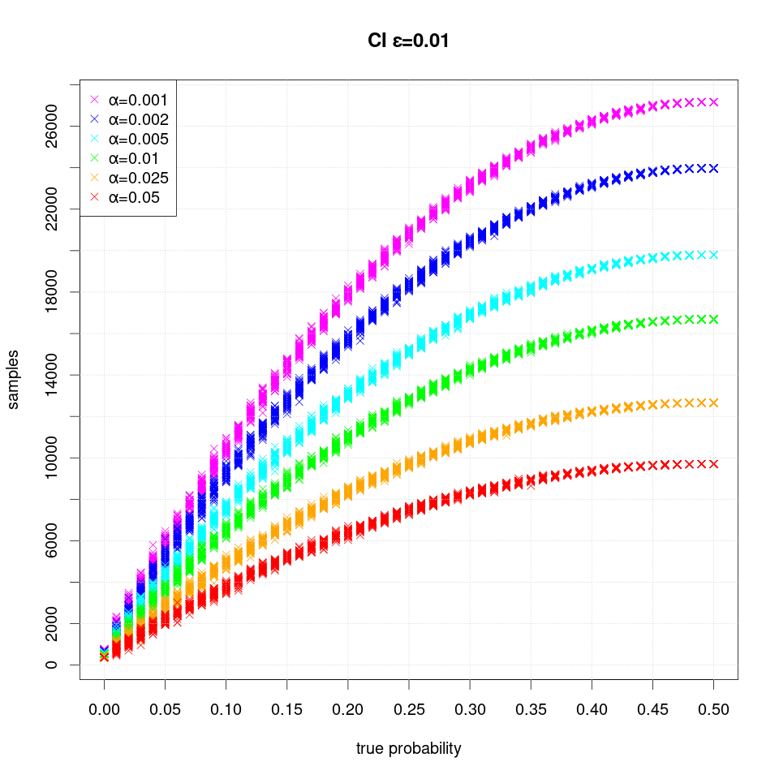
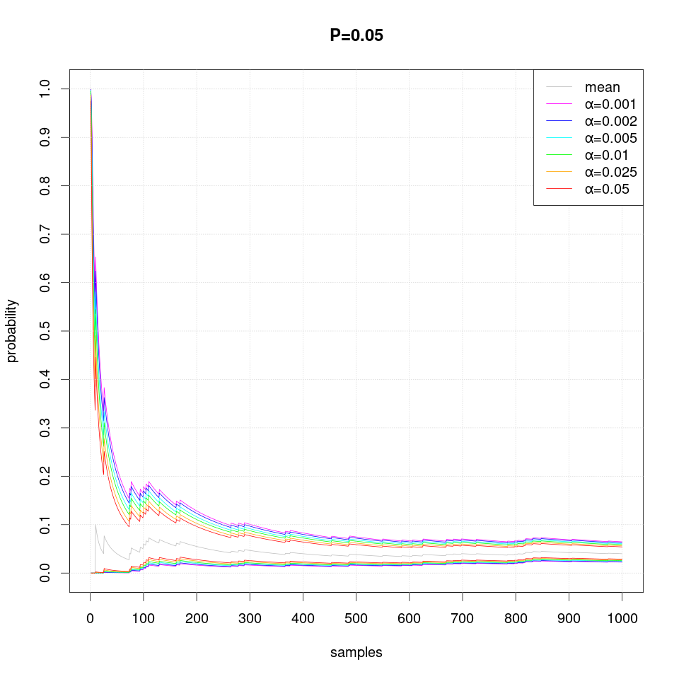
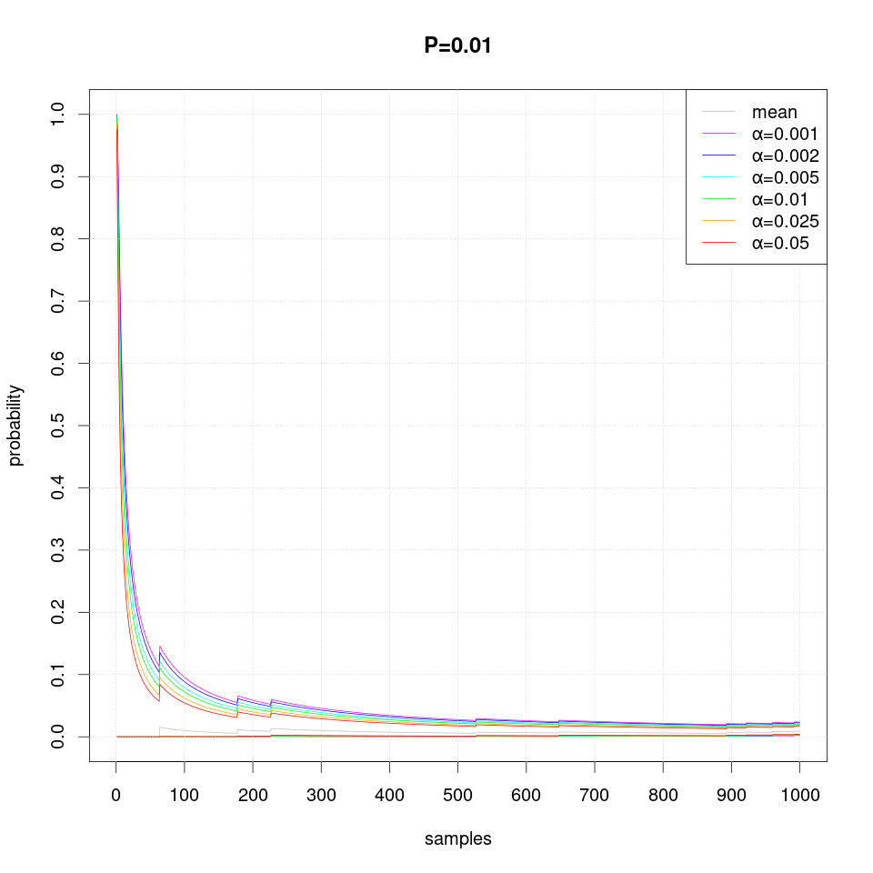
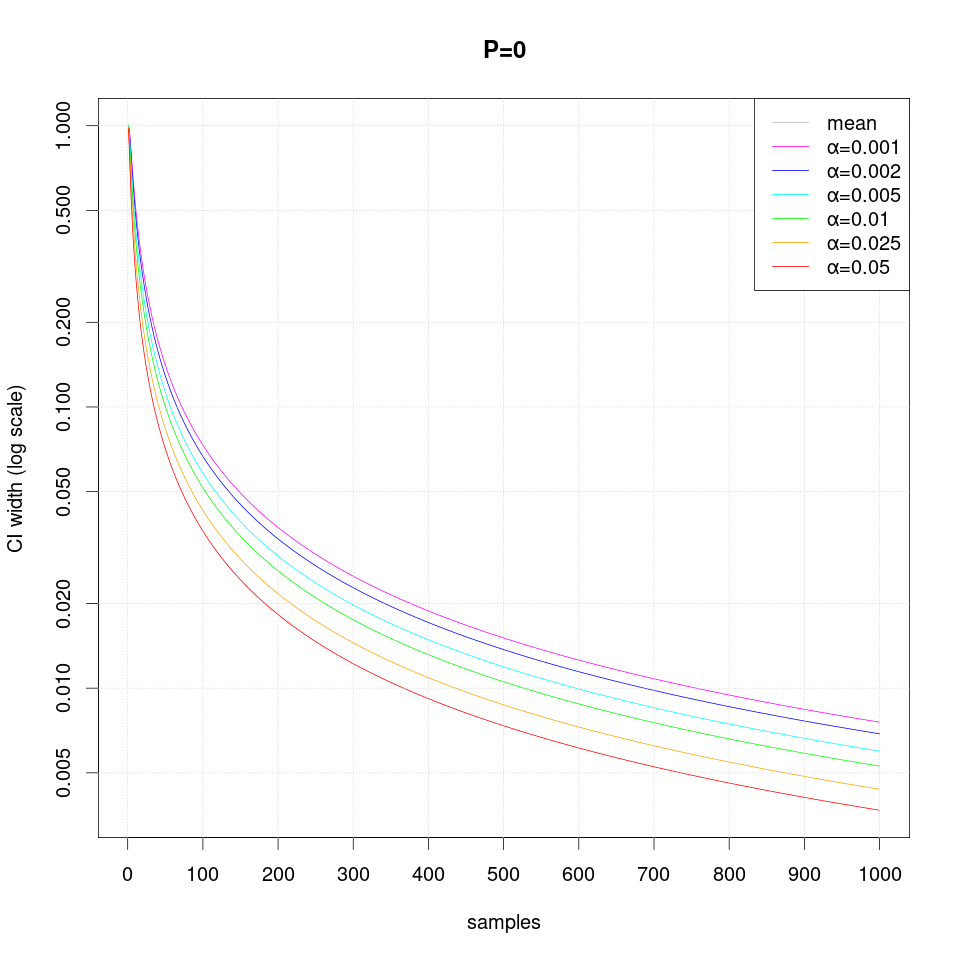

Probability estimation query <tt>Pr[...](<> q)</tt> yields a confidence interval (CI) for the probability of the state expression <tt>q</tt> being true with the confidence level of <tt>1-&alpha;</tt>. For example, it could be <tt>[0.45, 0.55]</tt> (<tt>95%</tt> CI), or could be written as <tt>0.5 &plusmn; 0.05</tt> (<tt>95%</tt> CI), where <tt>&epsilon;=0.05</tt> and <tt>&alpha;=0.05</tt>.

The frequentist interpretation of CI is that there exists a true probability that the state expression <tt>q</tt> is true and it is included in that confidence interval, but there is a risk &alpha; of making an error (the true probability being outside the confidence interval).

Chernoff-Hoeffding bound <tt>N=ln(2/&alpha;)/(2&epsilon;2)</tt> provides an intuition that the number of required samples (runs) N is inversely proportional to <tt>&epsilon;2</tt> and proportional to the <tt>ln(1/&alpha;)</tt>. This result assumes that the measurements are sampled from a continuous interval <tt>[0,1]</tt> which makes it overly conservative. For example, for <tt>&alpha;=0.05</tt> and <tt>&epsilon;=0.05</tt> it requires <tt>738</tt> runs irrespective of the actual probability. However, if the samples are constrained to either <tt>0</tt> or <tt>1</tt> and we observe a repetitive sequence of <tt>30</tt> successes we could conclude much earlier with <tt>[0.9,1]</tt> (<tt>95%</tt> CI) just by using a [statistical rule of three](https://en.wikipedia.org/wiki/Rule_of_three_(statistics)).

Instead, UPPAAL uses Clopper-Pearson exact method for binomial distribution which samples from <tt>{0,1}</tt> and provides more precise bounds with fewer runs, especially when the probability is close to <tt>0</tt> or <tt>1</tt>.

If the number of runs is not specified in the query, then the probability estimation uses Clopper-Pearson algorithm sequentially to determine when to stop generating the simulation runs thus allowing earlier termination. Therefore the number of runs is sensitive to <tt>&alpha;</tt>, <tt>&epsilon;</tt> and also the estimated probability itself. The &alpha; and &epsilon; parameters are controlled in the [statistical parameters](/gui-reference/menu-bar/options/#statparam) of engine options.

The following plots show the number of samples (runs) required to estimate the confidence interval using the exact method sequentially for a given <tt>&alpha;</tt>, <tt>&epsilon;</tt> and the true probability (estimating <tt>P>0.5</tt> is symmetric to estimating <tt>1-P</tt>):

For example, for the default parameter values <tt>&epsilon;=0.05</tt> and <tt>&alpha;=0.05</tt> the sequential algorithm requires <tt>411</tt> &mdash; the highest number of samples (runs) &mdash; when the probability is close to <tt>0.5</tt>, where the uncertainty is the highest. Whereas the algorithm cannot distinguish the true probabilities <tt>&leq; &epsilon;</tt> (<tt>0.05</tt>) and thus could terminate much earlier: after <tt>72</tt> runs. Note that the uncertainty of the required runs is the largest when the true probability is close to either <tt>0</tt> or <tt>1</tt>.

The following plot shows the number of samples (runs) required when the width of the interval is halved to <tt>&epsilon;=0.025</tt>:

The following plot shows the number of samples (runs) required when the width of the interval is even more narrow <tt>&epsilon;=0.01</tt>:

The following series of plots demonstrates how the estimated confidence interval converges to the true probability <tt>P</tt> value as more samples are produced:

Note that occasionally the confidence intervals may overstep and thus exclude the true probability value, which should not happen more often than the specified level of significance <tt>&alpha;</tt>.

The following sequence of plots show how the width of the confidence intervals converges as more samples are produced:

Note that in case of extreme probability value (close to <tt>0</tt> or <tt>1</tt>, e.g. <tt>P=0.01</tt>), repeated observations are more likely and thus they may create false confidence that the probability is extreme (i.e. <tt>0</tt> or <tt>1</tt>), but then a single differing observation may disturb the interval size greately and therefore more samples are required than just single sided interval.

Several sequential CI estimation algorithms for binomial proportion are described in the literature below.

> _Fixed-Width Sequential Confidence Intervals for a Proportion_, **Jesse Frey**. The American Statistician Volume 64, 2010 - Issue 3. [doi:10.1198/tast.2010.09140](https://doi.org/10.1198/tast.2010.09140)

> _Exact Group Sequential Methods for Estimating a Binomial Proportion_, **Zhengjia Chen** and **Xinjia Chen**. Journal of Probability and Statistics, 2013, special issue "Adaptive and Sequential Methods for Clinical Trials". [doi:10.1155/2013/603297](https://doi.org/10.1155/2013/603297)
