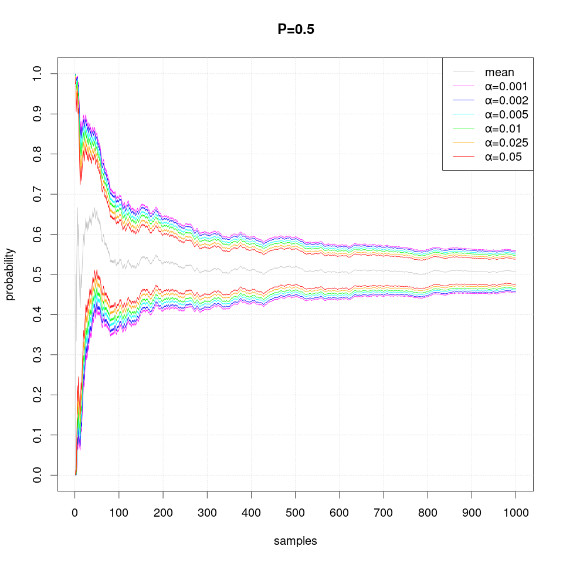
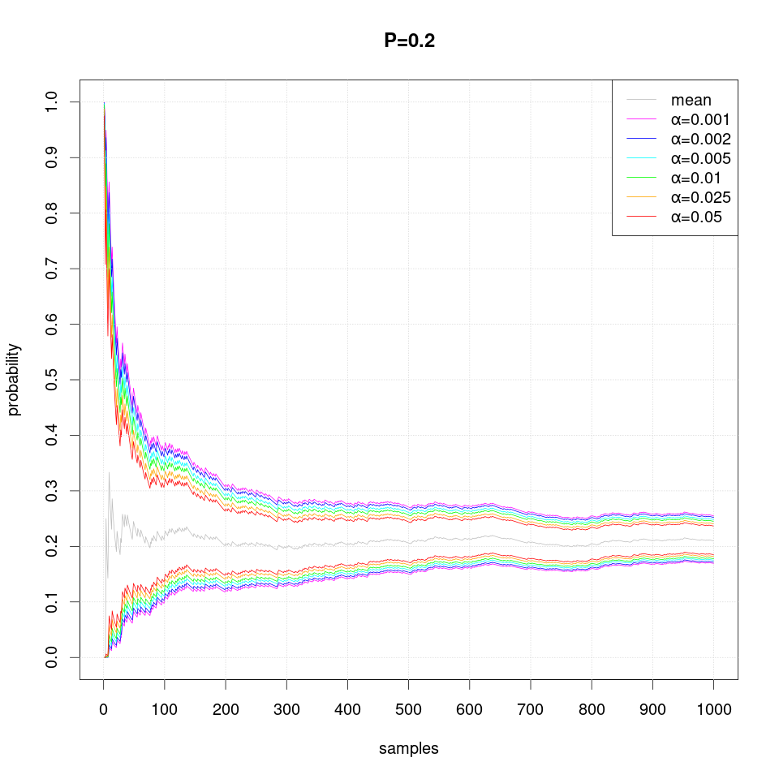
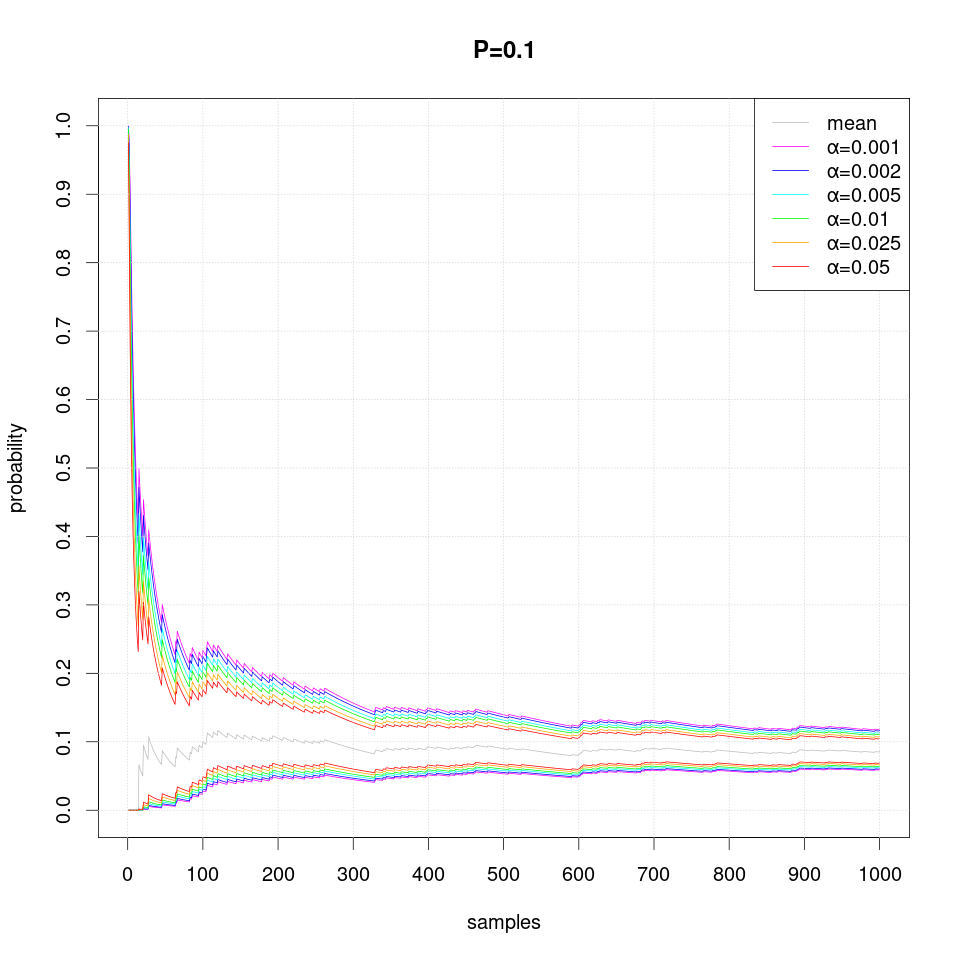

# Confidence Interval Estimation

Statistical queries without the number of runs specified, the estimation is performed adaptively: simulate, collect the statistics and repeat if more data is needed.

The confidence intervals converge to the true probability (P) value as more samples are produced:

     

Note that occasionally the confidence intervals may overstep and thus exclude the true probability value, which should not happen more often than the specified level of significance (α).

The width of the confidence intervals converges to zero as more samples are produced:

     

Note that in case of extreme probability value (close to 0 or 1, e.g. P=0.01), repeated observations are more likely and thus they may create false confidence that the probability is extreme (i.e. 0 or 1), but then a single differing observation may disturb the interval size and therefore more samples are required than just single sided interval. Therefore newer Uppaal versions use double-sided confidence interval estimation.
